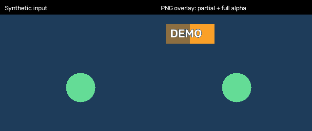

# OpenCV Video Overlay

A reusable Python utility and command-line application for blending transparent PNGs into videos.



The preview uses generated media and demonstrates both partial and full alpha transparency.

## Install

Use Python 3.10 or newer:

```bash
git clone https://github.com/FastenSeatBeltWhileSeated/opencv-video-overlay.git
cd opencv-video-overlay
python -m venv .venv
```

Activate with `source .venv/bin/activate` on Linux/macOS or `.venv\Scripts\Activate.ps1` in Windows PowerShell, then:

```bash
python -m pip install -e .
```

## Run a complete example

```bash
python examples/synthetic_demo.py
```

This creates an input video, a transparent PNG and an overlaid output under `examples/generated/`. No external media is required.

## Use your files

```bash
video-overlay --input input.avi --output output.avi --logo logo.png
video-overlay -i input.avi -o output.avi --logo logo.png --x 20 --y 20 --width 300 --height 100
```

Module entry point: `python -m video_overlay` with the same arguments.

| Argument | Default | Purpose |
| --- | --- | --- |
| `-i / --input` | Required | Source video |
| `-o / --output` | Required | Output AVI |
| `--logo` | `Logo.png` | Four-channel PNG |
| `--x / --y` | `20 / 20` | Position in pixels |
| `--width / --height` | `300 / 100` | Resized logo dimensions |

The logo must fit entirely within the frame. Output uses MJPG AVI and preserves source FPS when available, with a 30 FPS fallback. Audio is not copied. Input and output paths must differ; an existing output file may be replaced.

## Python API

```python
from video_overlay import process_video

frames = process_video("input.avi", "output.avi", "logo.png",
                       x=20, y=20, width=300, height=100)
```

## Structure

| Directory | Contents |
| --- | --- |
| `src/video_overlay/` | Reusable functions and CLI |
| `examples/` | Self-contained synthetic demonstration |
| `tests/` | Alpha, placement, bounds and video export checks |
| `docs/` | Maintenance notes and generated preview |

The former `logo.py` root script is now an installable package. See [maintenance notes](docs/maintenance.md).

## Test

```bash
python -m pip install -e ".[test]"
python -m pytest -q
```

Validation uses synthetic images and videos. This utility is a focused media-processing project.
